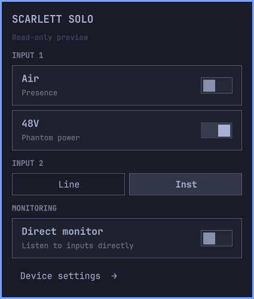
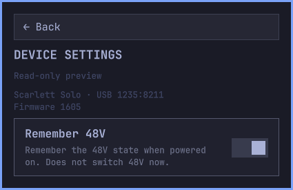

# Scarlett for Omarchy

Native bar controls for **Air**, **48V**, **Line / Inst**, and **direct monitoring**.
A distinct audio-interface icon opens a panel grouped by Input 1, Input 2,
and Monitoring, with explicit Line / Inst buttons. Hover shows 48V and direct
monitor status. The panel uses Omarchy's shared components and theme palette. Hardware state
comes directly from ALSA, including updates from the interface's buttons or
ALSA Scarlett Control Panel.

**Private development preview — not a public release.** Initially supports the
Scarlett Solo USB product `1235:8211`. Other models are intentionally not selected.
Multiple matching devices at startup are refused rather than chosen arbitrarily.

## Roadmap and contributions

See the **[development roadmap](docs/ROADMAP.md)** for planned device support,
native routing/mixer tools and the next milestones. These are planned features,
not claims of current support or release-date commitments.

**[Request a feature, report a bug, or request device support](https://github.com/davidkodar/omarchy-scarlett/issues/new/choose).**
Hardware testing, documentation and code contributions are welcome; see
[CONTRIBUTING.md](CONTRIBUTING.md) for how to help. While the repository remains
private, only invited collaborators can see it and participate. It will become
public only with the owner's approval.

## Requirements

- Omarchy with its Quickshell plugin system (developed against 4.0.2).
- Runtime: `alsa-lib`, `json-c`; Omarchy supplies Quickshell and its QML components.
- Build: a C compiler, `make`, and `pkgconf` (Arch's `base-devel` provides these).
- Tests: Python 3.


No new kernel driver, root service, PipeWire filter, or GUI fork is involved.
ALSA Scarlett Control Panel is not required and has no launcher in the plugin.
It remains an optional standalone tool for firmware maintenance and features
this plugin does not implement.

## Install and update

Omarchy's plugin manager clones the repository but does not compile helpers.
Run the bundled installer once after cloning; it checks dependencies, builds
locally, validates the plugin, backs up shell.json, and enables the widget.
It never downloads binaries or installs system packages.

```sh
omarchy plugin add https://github.com/davidkodar/omarchy-scarlett.git
cd ~/.config/omarchy/plugins/davidkodar.scarlett
./scripts/install.sh
```

While private, the repository requires GitHub access. If dependencies are
missing, the installer stops before changing the shell. On Omarchy, install
`base-devel`, `alsa-lib` and `json-c` using your package manager, then rerun it.

Scarlett is placed after the normal `omarchy.audio` volume widget when that
widget is in the right-hand section. Otherwise it is added to the right-hand
section. Reinstalling preserves Scarlett's existing position. A standard Audio
widget is **not** a dependency.

After pulling an update:

```sh
cd ~/.config/omarchy/plugins/davidkodar.scarlett
./scripts/install.sh
omarchy restart shell
```

The helper is replaced atomically after a successful build, so rebuilding does
not truncate a running executable. Restarting loads the new helper and clears
cached QML. No audio settings are restored by the plugin.

For development, clone into any directory and run `./scripts/install.sh` there.
It links the checkout into the plugin directory and refuses to replace another
installation. Keep that checkout in place. `install-dev.sh` is a compatibility
alias for the same installer.

## Disable and remove

To hide Scarlett without deleting anything:

```sh
omarchy plugin disable davidkodar.scarlett
```

To undo a development link, run `./scripts/uninstall.sh` from its checkout. This
backs up shell.json, disables the plugin and removes only the link it owns. It
retains the source code. For a checkout installed directly inside the plugin
directory, the script disables the plugin and retains that directory as well.

For complete removal of a plugin-manager installation, use Omarchy's normal
`omarchy plugin remove davidkodar.scarlett` command after saving any local edits.
This removes the installed checkout. No ALSA package needs to be uninstalled.

## Behavior

- Opening the panel reads settings; it never restores a preset or enables 48V.
- A click requests an explicit value. The switch follows confirmed ALSA state.
- Unsupported or read-only controls are disabled.
- Unplugging disables controls. The helper retries discovery while disconnected.
- Each connection has a generation number; stale requests are rejected.
- Helper failures disable the UI. Reopening the popup retries the helper.
- 48V is controlled only through its labeled row, never through the bar icon.
- **Device settings** opens a separate view with Back navigation. It shows model, USB identity and firmware version, plus a
  **Remember 48V** startup preference. This is separate from the current 48V
  switch and is never applied automatically by the plugin.
- Firmware updates and factory resets remain outside the plugin.

The small helper uses `alsa-lib` plus `json-c`, with newline-delimited JSON over
stdin/stdout. ALSA events drive updates while connected; discovery retries every
1.5 seconds only when disconnected. Each bar instance owns its helper process.

## Validation

`make check` runs eight hardware-free protocol tests and seven installer/removal
tests, plus an atomic-build test against a running helper. They cover malformed requests, read-only/disconnected writes, recovery
after bad input, missing/replaced Audio widgets, preservation of placement,
dependency/build failures and protection of unrelated installations. `--once` always opens ALSA read-only.

The optional live test writes **Air's current value back unchanged** to verify
write acknowledgement and readback. It also verifies stale-generation rejection.
It does not write 48V, instrument mode, or direct monitoring:

```sh
python3 tests/live_readback.py
```

`python3 tests/run_ui_smoke.py` runs a separate read-only Quickshell instance in
a live Wayland session. It checks page navigation, keyboard focus, palette and
spacing updates, vertical-bar settings, and missing-helper recovery. It does not
change the system theme or write audio settings. Avoid interacting with other
windows during this brief focus-sensitive test.

Read-only previews of the two native views:




See [the release checklist](docs/RELEASE.md) for checks still required before
publication. Current API usage follows the installed Omarchy shell, whose shared
components may evolve between versions.

## License and attribution

Original plugin and helper code: MIT. No source from `alsa-scarlett-gui` or the
kernel driver is copied into this repository. Omarchy's shared QML components
are imported from the installed system, not bundled. `alsa-lib` is dynamically
linked under its LGPL terms; `json-c` uses MIT. These system dependencies retain
their respective licenses.

Thanks to Geoffrey Bennett and contributors for Linux Focusrite driver support
and [ALSA Scarlett Control Panel](https://github.com/geoffreybennett/alsa-scarlett-gui),
and to [Omarchy](https://github.com/basecamp/omarchy) for the shell infrastructure.
This is an independent community project, unaffiliated with Focusrite.
